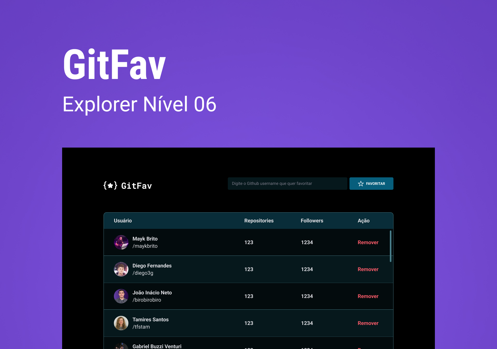

# Stage 06 Explorer

# GitFav

Um pequeno projeto desenvolvido na trilha Explorer da Rocketseat.

## Conteúdo Abordado

- Tabelas HTML
- Async e Await
- Classes JS
- Fetch e Then
- Throw e Catch
- Consumo de API's externas

